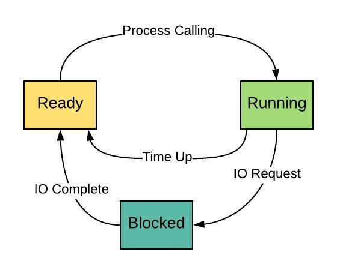

# 1. java-threads

## Java Threads Status Projects 

* Process: is the instance of a computer program that is being executed by one or many threads. It contains the program code and its activity.

* Process states: created -> waiting -> blocked -> terminated. 

* Three states: running, ready, blocked 

* Five states: New (start) -> Terminated -> Running -> Waiting -> Blocked.

## State Description
1. Start: initial state when a process is first started/created. 

2. Ready: waiting to be assigned to a processor.

3. Running: the process state is set to running and processor executes its instructions. 

4. waiting/blocked: such as waiting for user input, or waiting for a file to become available. 

5. Terminated or exit: once the process finishes its execution, or terminated by the os.   

## States change 

* Ready -> Running

* Running -> Ready

* Running -> Blocked 

* Blocked -> Ready

* Blocked -> Running [Never happens]

* Ready -> Blocked [Ready is not blocked]

## The diagram showing the states 

## Five States Model

1. Create / New Process 

2. Terminate 

## Five States Change 

- Null -> New

- New -> Ready

- Running -> Terminate

- Terminate -> NULL

- Ready -> Terminate

- Block -> Terminate 

# 2. JVM Threads 

## Process VS. Threads

* Process: Independent memory and data storage stack, at least one thread. 

* Thread: Sharing heap space, independent stack space, less resources consuming. 

### Note: 

1. Executing which thread is decided by the CPU, programmers can't interfere with it. 

2. Java Program contains at least two threads, main() and garbage collection thread.  

3. Creating a thread consumes more resources than a process, therefore multiple tasks project usually needs multi-thread. 

### Thread Scheduling

* Thread Scheduler in Java is the part of the JVM that decides which thread should run. 

* There is no guarantee that which runnable thread will be chosen to run by the thread scheduler. 

* Only one thread at a time can run in a single process. 

# 3. JVM Thread States - six states

Thread.java: Thread.getState() // Get thread states.  

- New

- Runnable (Including Running and Ready)

- Blocked

- Waiting

- Timed_waitting

- Terminated 

- Video 08 ---

